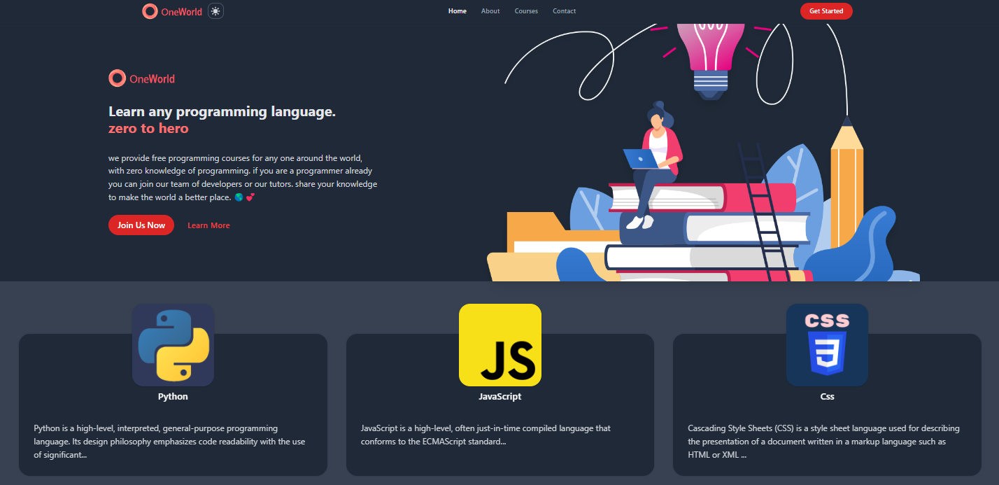

# Education site Landing Page

created with tailwind css and react js

[Live Demo](https://landing-page-tailwind-umber.vercel.app/)

 

 
 

# for installing dependencies run in terminal

`npm install`

# for starting development server

`npm start`

# building for production

`npm run build`
